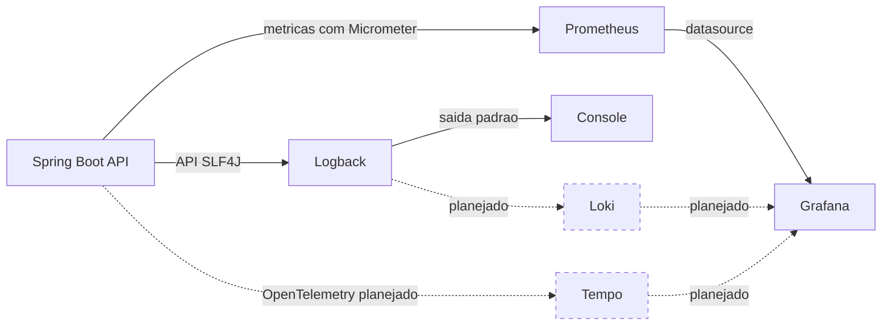

# Observabilidade

## Objetivo

A observabilidade do Code Arena deve ajudar a responder se a API esta
disponivel, como esta se comportando e por que uma requisicao falhou. A
estrategia sera implementada de forma incremental para evitar infraestrutura
sem necessidade durante as primeiras entregas.

## Visao geral

Linhas continuas representam a stack local implementada. Linhas tracejadas
representam a evolucao planejada, ainda fora do ambiente executavel.

Cada fluxo possui uma responsabilidade:

- **Metricas** representam medidas agregadas ao longo do tempo, como duracao e
  quantidade de requisicoes, erros HTTP, memoria da JVM e conexoes com o banco.
- **Logs** registram eventos individuais da aplicacao com contexto suficiente
  para diagnostico.
- **Visualizacao de logs** permite pesquisar e correlacionar logs de diferentes
  execucoes em uma interface centralizada.
- **Tracing** acompanha o caminho de uma requisicao entre componentes e mede o
  tempo gasto em cada etapa.

## Estrategia inicial da API

O bootstrap da API usara:

- Spring Boot Actuator para disponibilizar informacoes operacionais e health
  checks;
- Micrometer como fachada de instrumentacao;
- registro Prometheus para expor metricas no formato esperado pelo coletor;
- SLF4J como API de logging utilizada pelo codigo Java;
- Logback como implementacao de logging;
- console como destino dos logs.

O Logback ja faz parte da configuracao padrao do Spring Boot por meio do
`spring-boot-starter-logging`. A aplicacao deve programar contra a API do SLF4J,
sem depender diretamente de classes do Logback.

Os logs devem ser legiveis durante o desenvolvimento e enviados para a saida
padrao. A API nao deve depender de arquivos de log dentro do container. Senhas,
tokens, credenciais, cabecalhos de autorizacao e outros dados sensiveis nunca
devem ser registrados.

## Metricas locais

O Docker Compose local inclui Prometheus para coletar periodicamente o endpoint
`/actuator/prometheus` da API. A configuracao versionada define o target pelo
nome do servico na rede interna, sem depender da porta publicada no host.

O armazenamento usa um volume nomeado para preservar as series entre reinicios
locais. Essa retencao e destinada a diagnostico e estudo, nao representa uma
politica de retencao de producao.

## Dashboards locais

O Grafana consulta o Prometheus por um datasource provisionado e carrega o
dashboard versionado **Code Arena API** sem configuracao manual. O acesso local
e anonimo e somente leitura; nao existem credenciais administrativas padrao no
repositorio.

O dashboard apresenta disponibilidade, volume e latencia media das requisicoes,
respostas por status HTTP, memoria da JVM e conexoes do pool do banco. Percentis
de latencia serao adicionados quando a API habilitar buckets de histograma; sem
eles, uma consulta p95 nao teria dados confiaveis.

Metricas de negocio, como tentativas iniciadas e concluidas, devem ser
adicionadas quando os respectivos comportamentos existirem.

## Evolucao planejada

Logs centralizados e tracing distribuido nao fazem parte do bootstrap:

1. Loki sera avaliado para armazenar e consultar os logs no Grafana.
2. Logs estruturados em JSON e um identificador de correlacao serao adicionados
   quando houver um coletor definido.
3. OpenTelemetry sera avaliado para instrumentacao e propagacao de contexto.
4. Tempo sera avaliado como backend de tracing integrado ao Grafana.

Esses componentes somente devem ser adicionados quando houver um fluxo real
para observar e criterios de aceite que justifiquem sua operacao.

## Producao

O destino inicial na AWS continua usando os servicos de observabilidade
definidos para a plataforma, como CloudWatch. A stack local com Prometheus,
Grafana, Loki e Tempo nao implica que os mesmos componentes precisem ser
operados em producao. A escolha de producao deve considerar custo, retencao,
seguranca e integracao com o servico de hospedagem da API.
