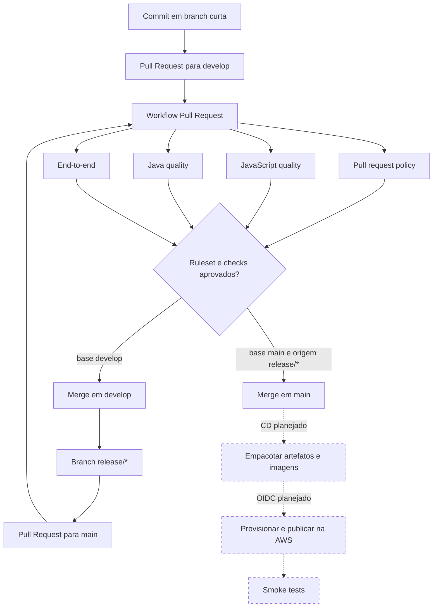
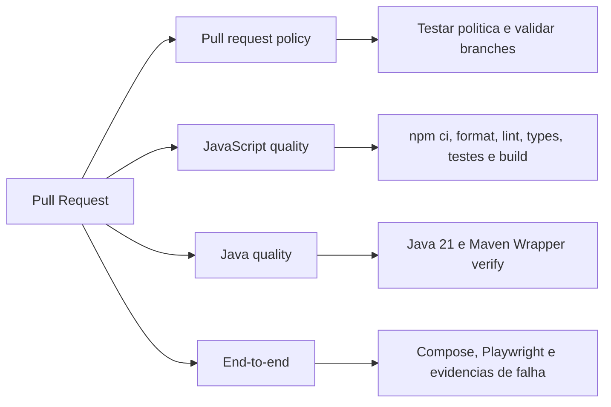

# Integracao continua

O GitHub Actions valida cada Pull Request destinado a `develop` ou `main`. O
objetivo e repetir os checks em um ambiente independente antes do merge.

Workflow:

```text
.github/workflows/pull-request.yml
```

## Quando executa



Novos commits no mesmo PR cancelam a execucao anterior. Isso evita gastar tempo
com uma revisao que ja foi substituida.

As linhas continuas representam a integracao continua implementada. As linhas
tracejadas representam o CD planejado; o repositorio ainda nao publica recursos
na AWS automaticamente.

## Permissoes

O workflow declara apenas:

```yaml
permissions:
  contents: read
```

Ele precisa ler o repositorio, mas nao cria commits, comentarios, releases ou
deploys. Pipelines futuros devem receber somente as permissoes necessarias.

## Ambiente

- Runner hospedado pelo GitHub com Ubuntu.
- Node obtido de `.nvmrc`.
- Java 21 com distribuicao Eclipse Temurin.
- Cache de dependencias npm administrado por `actions/setup-node`.
- Cache de dependencias Maven administrado por `actions/setup-java`.
- Instalacao reproduzivel com `npm ci` e `package-lock.json`.
- Maven Wrapper como versao reproduzivel do Maven.
- Timeouts por job para evitar execucoes presas indefinidamente.

O workflow usa actions oficiais nas linhas atuais:

```text
actions/checkout@v6
actions/setup-node@v6
actions/setup-java@v5
```

## Etapas

O workflow possui quatro jobs independentes:



`apps/web` consome `@code-arena/java-quiz-sdk` pelas exportacoes geradas em
`packages/java-quiz-sdk/dist`. Como `dist` e um artefato ignorado pelo Git e nao
existe depois de um checkout limpo, os scripts raiz `typecheck`, `test` e `build`
executam primeiro `npm run build:sdk`. Essa ordem torna cada comando raiz
reproduzivel na CI sem versionar arquivos gerados nem importar fontes internas
do SDK diretamente.

Separar os jobs permite distinguir uma violacao do fluxo de branches de uma
falha de qualidade JavaScript, Java ou do fluxo ponta a ponta.

### Politica do Pull Request

O job `Pull request policy` executa:

```bash
bash .github/scripts/validate-pull-request-branch.test.sh
bash .github/scripts/validate-pull-request-branch.sh "$BASE_REF" "$HEAD_REF"
```

Pull Requests destinados a `main` so podem partir de `release/*` ou `hotfix/*`.
Uma feature, documentacao, chore, fix ou a propria `develop` direcionada a
`main` faz o job falhar.

Para `develop`, o job aceita branches curtas sem restringir seus prefixos nesta
primeira versao. O fluxo esperado continua documentado e pode ser endurecido
quando houver uma necessidade observada.

### Qualidade JavaScript

```text
checkout
   |
setup Node + cache
   |
npm ci
   |
format:check
   |
lint
   |
typecheck
   |
test
   |
build
```

### Formatacao

```bash
npm run format:check
```

Confirma que arquivos versionados seguem o Prettier sem modificar o checkout.

### Analise estatica

```bash
npm run lint
```

Executa ESLint no monorepositorio.

### Tipos

```bash
npm run typecheck
```

Valida os contratos TypeScript de todos os workspaces que declaram o script.

### Testes

```bash
npm test
```

Executa Vitest nos workspaces. A tolerancia temporaria a ausencia de casos sera
removida quando o primeiro comportamento testavel for implementado.

### Build

```bash
npm run build
```

Confirma que web, SDK e UI podem gerar seus artefatos.

### Qualidade Java

```bash
cd apps/api
./mvnw --batch-mode --no-transfer-progress verify
```

Compila a API, executa os testes e empacota a aplicacao. Os testes de integracao
usam Testcontainers e exigem o Docker disponivel no runner.

## Relacao com hooks locais

Husky e lint-staged oferecem feedback rapido antes do commit, mas podem ser
ignorados ou variar conforme a maquina. A CI executa o conjunto completo em um
ambiente limpo. As duas camadas sao complementares.

O repositorio publico possui os Rulesets `Protect main` e `Protect develop`. Os
dois exigem o job `JavaScript quality` como status check antes do merge.
`Protect main` tambem exige `Pull request policy`, depois que o GitHub reconhece
o novo check em sua primeira execucao. Depois da primeira execucao do backend,
`Java quality` tambem deve ser marcado como obrigatorio nos dois Rulesets. As
validacoes locais continuam necessarias para oferecer feedback antes do Pull
Request e facilitar o diagnostico de falhas.

## Diagnostico

Se o workflow falhar:

1. identifique a primeira etapa com erro;
2. reproduza localmente o mesmo comando;
3. corrija a causa, sem desabilitar um teste valido;
4. execute o conjunto completo;
5. envie um novo commit para o mesmo PR.
