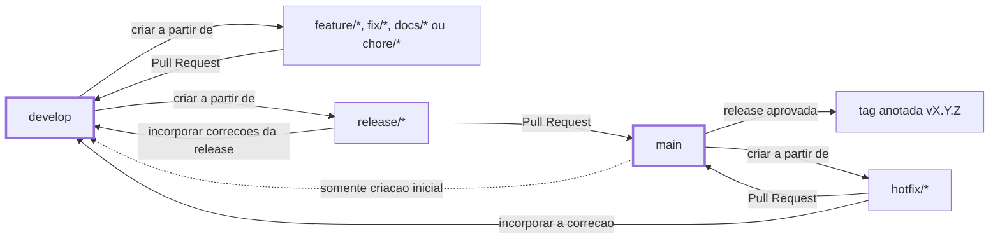
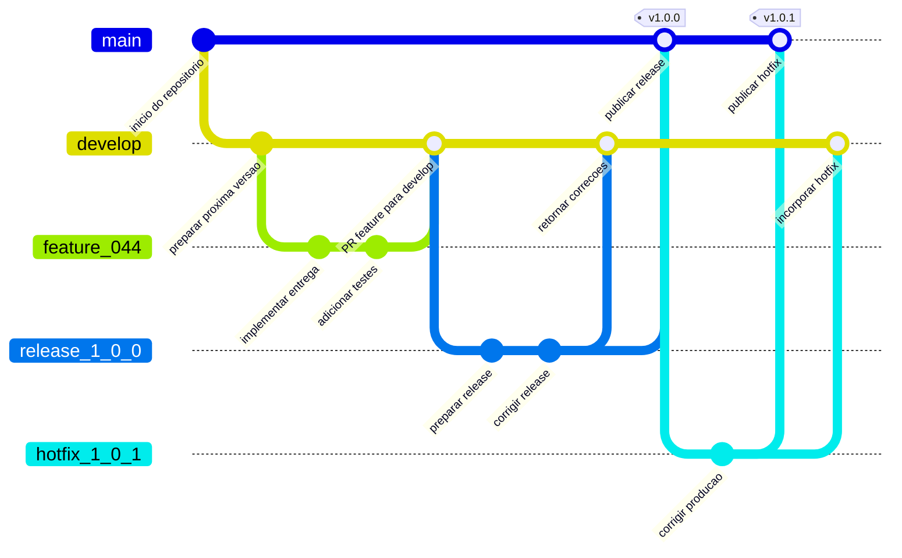
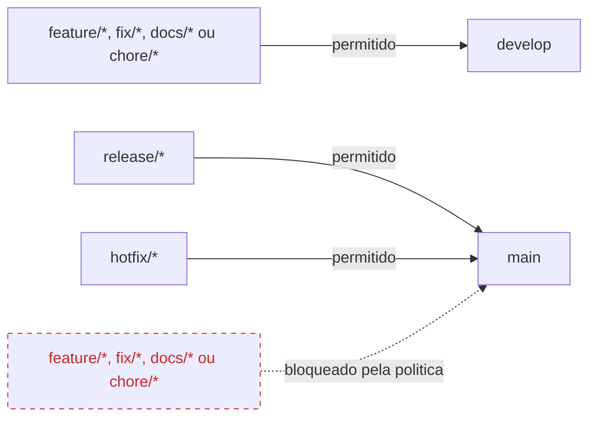

# Fluxo de trabalho com Git

Este guia descreve o Git Flow simplificado do Code Arena. Os rotulos das setas
diferenciam a criacao de uma branch da direcao de um Pull Request.



`develop` nasce de `main` somente na configuracao inicial e depois permanece
como branch permanente. Correcoes feitas em `release/*` ou `hotfix/*` retornam
diretamente dessas branches para `develop`; nao se usa uma sincronizacao geral
entre `main` e `develop` para substituir esses retornos explicitos.

## Exemplo de historico

O `flowchart` anterior define as regras. O `gitGraph` abaixo mostra apenas um
exemplo cronologico de commits e merges que respeita essas regras:



Os identificadores `feature_044`, `release_1_0_0` e `hotfix_1_0_1` evitam
caracteres que alguns renderizadores interpretam de forma diferente. No Git,
eles representam, respectivamente, branches como `feature/044-descricao`,
`release/1.0.0` e `hotfix/1.0.1-descricao`.

## Branches permanentes

- `main`: estado estavel e releases.
- `develop`: integracao da proxima versao.

Essas branches nao devem ser removidas. A opcao do GitHub que apaga head branches
depois do merge exige cuidado: nunca abra um PR tendo `develop` como origem
apenas para sincroniza-la com `main`, a menos que esteja preparado para restaura-
la.

## Iniciar uma feature

```bash
git fetch --prune origin
git switch develop
git pull --ff-only origin develop
git switch -c feature/NNN-descricao-curta
```

- `fetch --prune` atualiza referencias e remove referencias remotas obsoletas.
- `switch develop` seleciona a branch de integracao.
- `pull --ff-only` atualiza sem criar merge commit inesperado.
- `switch -c` cria e seleciona a branch da entrega.

## Inspecionar alteracoes

```bash
git status --short --branch
git diff
git diff --check
```

Antes do commit, revise os arquivos, execute as validacoes relevantes e proponha
uma mensagem Conventional Commit.

## Criar um commit

```bash
git add caminho/do/arquivo
git diff --cached
git commit -m "tipo(escopo): descreve a intencao"
```

Exemplos:

```text
feat(api): create quiz attempt
fix(sdk): prevent repeated token refresh
test(ui): cover progress bar accessibility
docs(architecture): record authentication decision
```

Commits devem representar uma intencao. Implementacao e seus testes podem fazer
parte do mesmo commit quando formam uma unidade coerente.

## Publicar e abrir o PR

```bash
git push -u origin feature/NNN-descricao-curta
```

No GitHub, confirme explicitamente:

```text
base: develop
compare: feature/NNN-descricao-curta
```

`develop` e a base porque concentra as entregas que formarao a proxima versao.
Features, correcoes de desenvolvimento e documentacao precisam ser integradas e
validadas em conjunto antes de serem promovidas para `main`.

Usar `main` como base de uma feature pularia essa etapa de integracao e colocaria
uma mudanca ainda nao liberada na branch que representa producao e releases
estaveis. `main` recebe Pull Requests de `release/*` e `hotfix/*`, nao o
desenvolvimento cotidiano.

O link generico exibido pelo `git push` usa a branch padrao `main` como base. Ao
criar o PR pela interface, use uma URL de comparacao explicita:

```text
https://github.com/WilliamRochaJR/code-arena/compare/develop...<branch-codificada>?expand=1&title=<titulo-codificado>&body=<descricao-codificada>
```

Codifique a `/` do nome da branch como `%2F`. Por exemplo,
`docs/011-web-readme-quality` se torna
`docs%2F011-web-readme-quality`. O link deve abrir com `base: develop` e
`compare: docs/011-web-readme-quality`; confirme esses dois campos antes de
criar o PR. Aplique URL encoding ao titulo e a descricao completa para que o
formulario tambem abra com esses campos preenchidos. A descricao segue
`.github/pull_request_template.md` e registra somente mudancas e validacoes
realmente realizadas.

O PR registra objetivo, criterios de aceite, validacoes, riscos e itens fora do
escopo.

## Depois do merge de uma feature

```bash
git fetch --prune origin
git switch develop
git pull --ff-only origin develop
git branch -d feature/NNN-descricao-curta
```

`-d` recusa excluir uma branch que o Git local nao reconheca como integrada. Nao
use `-D` sem investigar.

## Preparar uma release

```bash
git switch develop
git pull --ff-only origin develop
git switch -c release/1.0.0
```

O Pull Request da release usa:

```text
base: main
compare: release/1.0.0
```

Depois do merge e da validacao:

```bash
git switch main
git pull --ff-only origin main
git tag -a v1.0.0 -m "Code Arena 1.0.0"
git push origin v1.0.0
```

Os criterios para escolher a versao, preparar a release e proteger a tag estao
no [guia de versionamento, releases e tags](versioning-and-releases.md).

As correcoes exclusivas da release tambem precisam voltar para `develop` por um
fluxo explicito que nao use `develop` como head descartavel.

## Hotfix

```bash
git switch main
git pull --ff-only origin main
git switch -c hotfix/1.0.1-descricao-curta
```

O hotfix entra em `main` por PR e sua correcao tambem deve ser incorporada em
`develop`.

## Acoes proibidas no fluxo normal

```text
push direto em main ou develop
git push --force em branches compartilhadas
git reset --hard para descartar trabalho sem revisao
commitar tokens, senhas, chaves ou arquivos .env reais
```

## Protecao no GitHub

Git define branches, commits e historico; o GitHub adiciona Pull Requests,
Rulesets, Actions e politicas sobre o repositorio hospedado. As configuracoes de
protecao de `main` e `develop` estao no
[guia de configuracao do GitHub](github-repository-settings.md).

As protecoes nao substituem a verificacao da direcao do Pull Request:



O check `Pull request policy` bloqueia tecnicamente qualquer origem diferente de
`release/*` ou `hotfix/*` quando a base e `main`. A validacao automatica evita
que uma feature seja mesclada diretamente na branch estavel mesmo que o
formulario do GitHub selecione a base incorreta.

Correcoes de release e hotfix tambem precisam ser incorporadas em `develop`.
