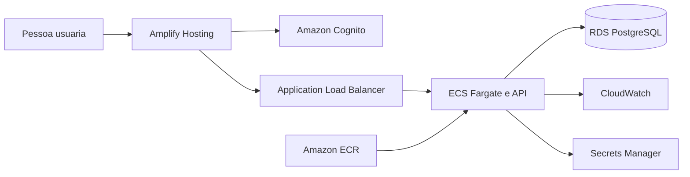

# Terraform

Bootstrap da infraestrutura AWS do Code Arena. O estado atual configura versoes,
provider, tags, variaveis e outputs, mas ainda nao declara recursos AWS.

## Arquitetura alvo



O ambiente sera temporario: uma entrega posterior podera cria-lo com
`terraform apply` para demonstracao e devera remove-lo com `terraform destroy`.
Fargate, ALB, RDS, IPv4, imagens, logs e segredos podem gerar custos enquanto
existirem; Free Tier e creditos nao sao tratados como garantia de custo zero.

## Validar sem provisionar

```bash
terraform -chdir=infrastructure/terraform fmt -check
terraform -chdir=infrastructure/terraform init -backend=false
terraform -chdir=infrastructure/terraform validate
```

`init` baixa o provider para o cache local e cria o lock file, mas nao cria
recursos. `validate` verifica referencias e tipos sem executar `apply`.

Nao execute `plan`, `apply` ou `destroy` sem revisar conta, regiao, custos e
estado. Nunca versione credenciais, `terraform.tfvars` real ou arquivos de
estado. A autenticacao local deve usar o mecanismo seguro configurado pela AWS
CLI; as credenciais nao pertencem a variaveis Terraform.

Consulte o [ADR 0008](../../docs/decisions/0008-use-ephemeral-ecs-fargate-on-aws.md)
para o contexto e as alternativas.
