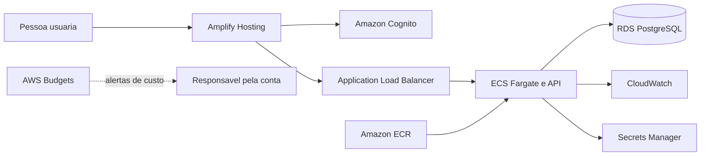
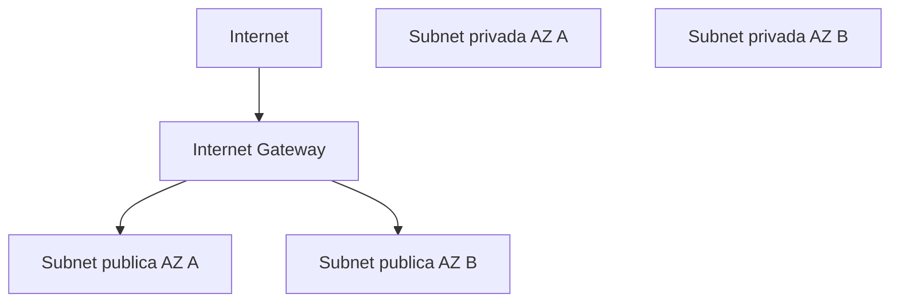

# Terraform

Infraestrutura AWS do Code Arena. O estado atual configura um budget de
monitoramento e a fundacao de rede, mas ainda nao declara os servicos da
aplicacao.

## Arquitetura alvo



O ambiente sera temporario: uma entrega posterior podera cria-lo com
`terraform apply` para demonstracao e devera remove-lo com `terraform destroy`.
Fargate, ALB, RDS, IPv4, imagens, logs e segredos podem gerar custos enquanto
existirem; Free Tier e creditos nao sao tratados como garantia de custo zero.

## Guardrails de custo

O budget monitora o custo mensal total da conta, com limite padrao de USD 10.
Ele envia alertas reais em 50%, 80% e 100% e um alerta previsto em 80%. AWS
Budgets nao interrompe recursos nem define um teto de cobranca; os dados podem
levar horas para atualizar.

O e-mail nao possui default e deve ser fornecido fora do repositorio:

```bash
export TF_VAR_budget_notification_email=<email-de-notificacao>
```

## Fundacao de rede



A VPC usa duas sub-redes publicas e duas privadas em AZs distintas. Somente as
publicas possuem rota para o Internet Gateway, mas nao atribuem IPv4 publico
automaticamente. As privadas nao possuem egress. NAT Gateway, VPC endpoints,
Elastic IP, ECS, ALB e RDS permanecem fora desta entrega.

## Validar sem provisionar

```bash
terraform -chdir=infrastructure/terraform fmt -check
terraform -chdir=infrastructure/terraform init -backend=false
terraform -chdir=infrastructure/terraform validate
```

`init` baixa o provider para o cache local e cria o lock file, mas nao cria
recursos. `validate` verifica referencias e tipos sem executar `apply`.

Nao execute `plan`, `apply` ou `destroy` sem revisar conta, regiao, custos e
estado. Nunca versione credenciais, `terraform.tfvars` real ou arquivos de
estado. A autenticacao local deve usar o mecanismo seguro configurado pela AWS
CLI; as credenciais nao pertencem a variaveis Terraform.

Consulte o [ADR 0008](../../docs/decisions/0008-use-ephemeral-ecs-fargate-on-aws.md)
para o contexto e as alternativas.
